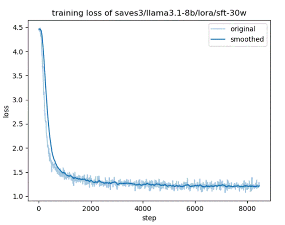
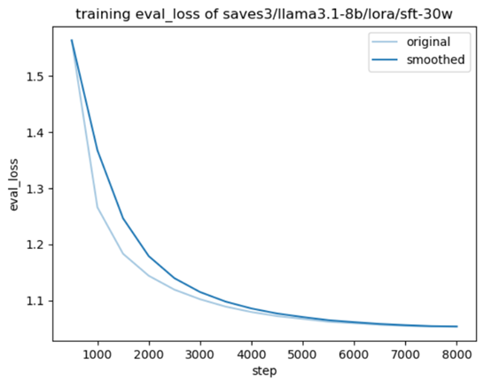
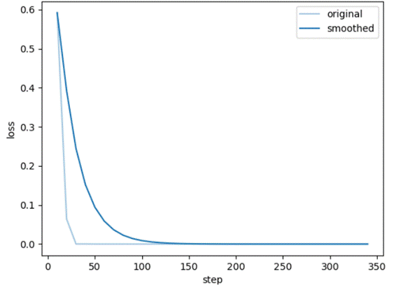
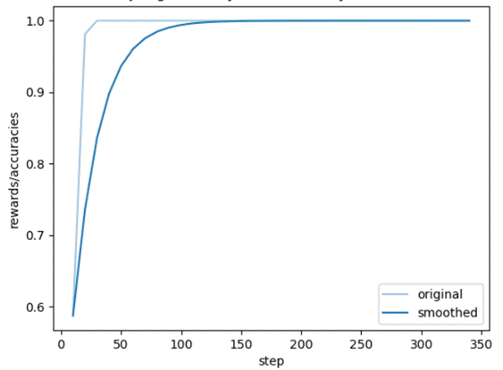

# llama-3.1-8b-chinese-instruct with SFT and DPO

## 项目简介

LLAMA-3.1-8B-Instruct 模型，以其庞大的参数规模、强大的上下文理解能力和灵活的指令遵循能力，在全球范围内赢得了广泛的关注与赞誉。该模型在多种自然语言处理任务上展现出卓越的性能，包括但不限于文本生成、问答系统、文本摘要等，为人工智能领域的研究与应用提供了强大的技术支持。

然而，尽管LLAMA-3.1-8B-Instruct模型在多种语言环境下均表现出色，但在中文这一特定语境下，其性能却存在一定的局限性。为了弥补这一不足，本项目旨在通过针对中文语境的深入优化，提升LLAMA 3.1-8B-Instruct模型在中文处理上的能力。

本项目基于llama-3.1-8b-instruct模型，在llama-factory的框架下，使用近30w条中文数据进行微调（Fine-tuning），并尝试应用了动态提示优化（Dynamic Prompt Optimization, DPO）技术，旨在提升模型在中文语境下的理解和生成能力。

#### 模型特点

基础模型：基于开源的llama3.1-8b-instruct，这是一个经过指令微调的大型语言模型。

中文优化：通过大量中文数据集进行微调，提升模型在中文处理上的表现。

DPO训练：采用动态提示优化技术，进一步优化模型在特定任务上的性能。

 

## 安装与加载

克隆本项目到本地：https://huggingface.co/jiangfb/llama-3.1-chinese-8b-it-dpo

git clone 

cd llama-3.1-chinese-8b-it-dpo

 

## 模型测评

#### Ceval

C-Eval 是一个全面的中文基础模型评估套件。它包含了大量的多项选择题，涵盖了人文、社科、理工以及其他专业四个大方向，包括52个不同的学科和四个难度级别。

| C-Eval | Average | Average(hard) | STEM | Social Sciences | Humanities | Other |
| ------ | ------- | ------------- | ---- | --------------- | ---------- | ----- |
| 原模型 | 24.1    | 23.5          | 23.9 | 25.3            | 24.6       | 22.7  |
| 训练后 | 44.7    | 32.9          | 41.8 | 52.7            | 42.0       | 44.5  |

#### Cmmlu
CMMLU是一个综合性的中文评估基准，专门用于评估语言模型在中文语境下的知识和推理能力。CMMLU涵盖了从基础学科到高级专业水平的67个主题。它包括：需要计算和推理的自然科学，需要知识的人文科学和社会科学,以及需要生活常识的中国驾驶规则等。

| CMMLU  | Average | STEM  | Social Sciences | Humanities | Other |
| ------ | ------- | ----- | --------------- | ---------- | ----- |
| 原模型 | 25.3    | 26.04 | 25.19           | 25.79      | 25.26 |
| 训练后 | 46.54   | 39.31 | 47.21           | 47.41      | 51.34 |

 

## 数据集

微调数据集：

|                         |                                  |
| --------------------- | ------------------------------------------------------------ |
| 中文微调数据集        | https://modelscope.cn/datasets/zhuangxialie/Llama3-Chinese-Dataset/files |
| train_1M_CN           | https://huggingface.co/datasets/BelleGroup/train_1M_CN       |
| chinese_modern_poetry | https://huggingface.co/datasets/Iess/chinese_modern_poetry   |
| code                  | https://huggingface.co/datasets/iamtarun/python_code_instructions_18k_alpaca |
| mathglm               | https://cloud.tsinghua.edu.cn/d/8d9ee3e52bb54afd9c16/        |

dpo数据集：

|                   |                                                            |
| ----------------- | ---------------------------------------------------------- |
| DPO-En-Zh-20k     | https://huggingface.co/datasets/hiyouga/DPO-En-Zh-20k      |
| orca_dpo_pairs    | https://huggingface.co/datasets/Intel/orca_dpo_pairs       |
| Chinese-dpo-pairs | https://huggingface.co/datasets/wenbopan/Chinese-dpo-pairs |
| DPO-zh-en-emoji   | https://huggingface.co/datasets/shareAI/DPO-zh-en-emoji    |

 

Sft图像：

Dpo：

Training loss:

Training rewards:  

